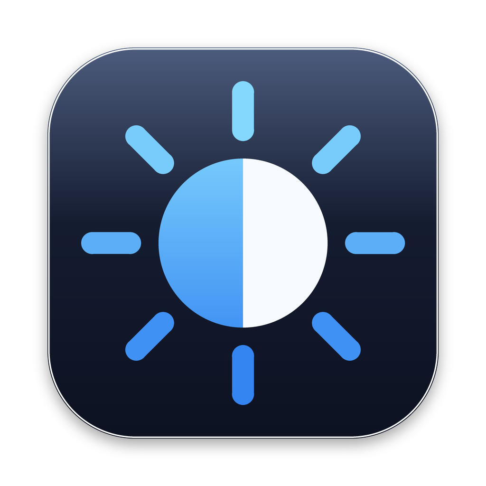
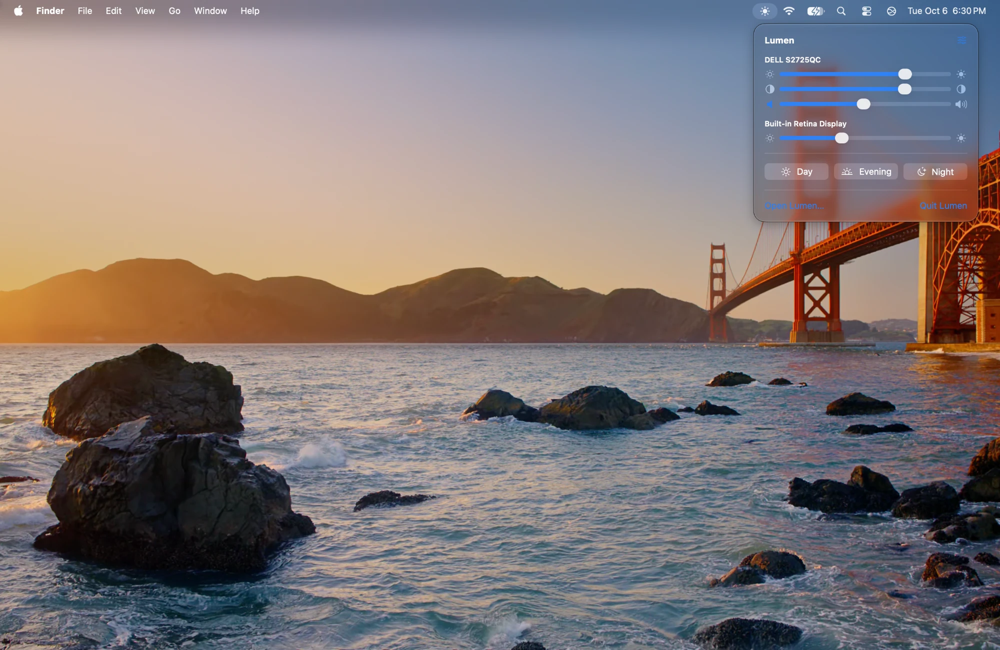
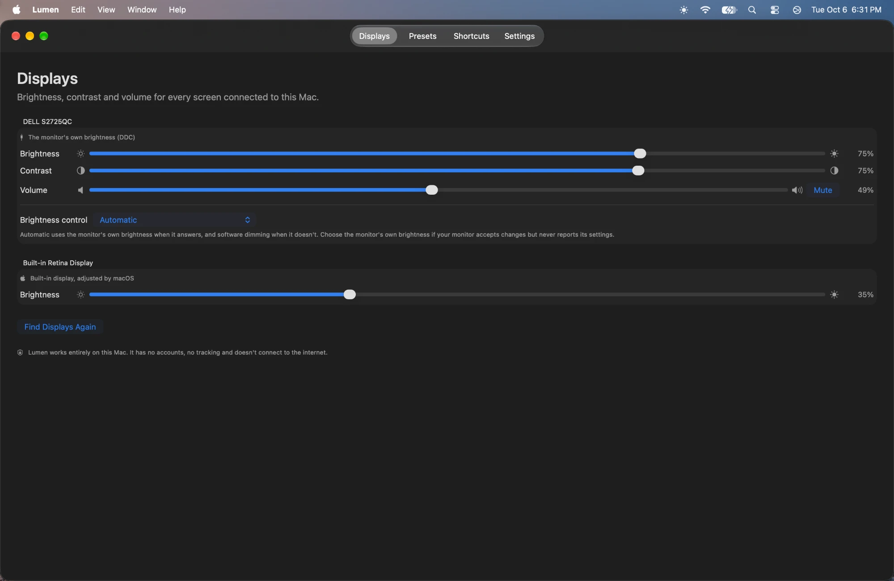
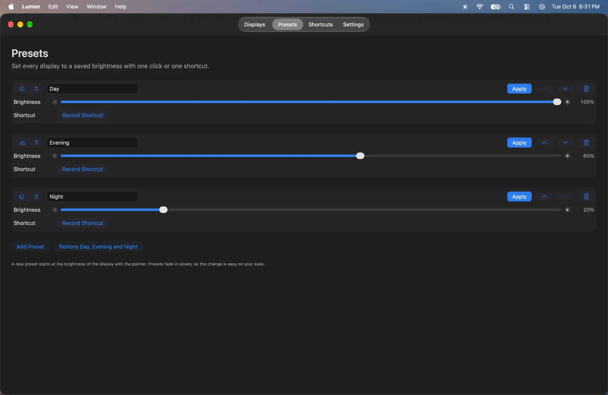
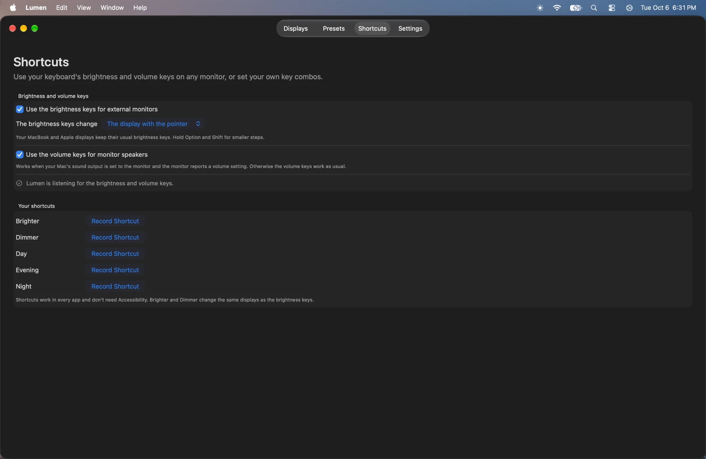
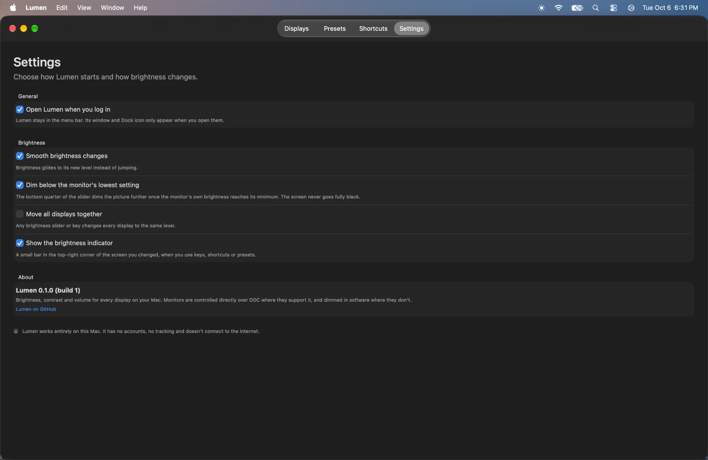

<p align="center">
  
</p>

<h1 align="center">Lumen</h1>

<p align="center">Brightness, contrast and volume for every display on your Mac, from the menu bar or your keyboard.</p>

<p align="center"><a href="https://github.com/9phfr6dsw4-dotcom/Lumen/releases/latest"><strong>Download the latest release</strong></a> · macOS 26+ · Apple Silicon</p>

<p align="center">
  <a href="https://github.com/9phfr6dsw4-dotcom/Lumen/releases/latest"></a>
  
  <a href="https://github.com/9phfr6dsw4-dotcom/Lumen/actions/workflows/macos-ci.yml"></a>
  <a href="LICENSE"></a>
</p>

## Features

- Change the brightness of external monitors with their own backlight (DDC), right from the menu bar.
- Monitors that can't be controlled directly (some docks, adapters, TVs, AirPlay and Sidecar) are dimmed in software instead. Lumen works out which is which on its own.
- Dim below a monitor's lowest setting for late nights. The screen never goes fully black.
- Contrast and speaker volume sliders for monitors that support them.
- Your keyboard's brightness keys work on the monitor under the pointer (or on every display), and the volume keys control the monitor's speakers when sound plays through them.
- Presets such as Day, Evening and Night set every display at once, each with its own shortcut.
- Your own shortcuts for brighter and dimmer, a smooth fade between levels, and a small indicator in the corner of the screen you changed.

## Screenshots



*Menu bar*



*Displays*



*Presets*



*Shortcuts*



*Settings*

## Install

1. Download `Lumen.zip` from the [latest release](https://github.com/9phfr6dsw4-dotcom/Lumen/releases/latest), unzip it, and move Lumen into Applications.
2. Open it. The builds aren't notarized, so the first time macOS says it can't check the app: open **System Settings → Privacy & Security** and choose **Open Anyway**.
3. Lumen appears in the menu bar as a sun. To use the brightness and volume keys on your monitors, allow Lumen in **System Settings → Privacy & Security → Accessibility** when it asks. After each update, remove the old Lumen entry there and turn on the new one.

## How it works

- **Monitors over DDC:** most external monitors accept brightness, contrast and volume commands over their video cable (DDC/CI). Lumen sends them through macOS's display services on Apple Silicon. Some HDMI ports, docks and adapters don't pass these commands on.
- **Software dimming:** a dark layer over the whole screen. It's used for screens that can't be controlled directly, and for the extra dimming below a monitor's minimum.
- **MacBook and Apple displays:** Lumen uses macOS's own brightness control, and the keyboard keeps working as usual on them.

Lumen has no accounts, no tracking and doesn't connect to the internet.

## Building

GitHub Actions builds, tests and packages the app on macOS 26 (`.github/workflows/macos-ci.yml`). Locally, with Xcode 26:

```sh
swift test
bash Scripts/package-app.sh   # creates dist/Lumen.zip
```

## License

Lumen is under the MIT License.
